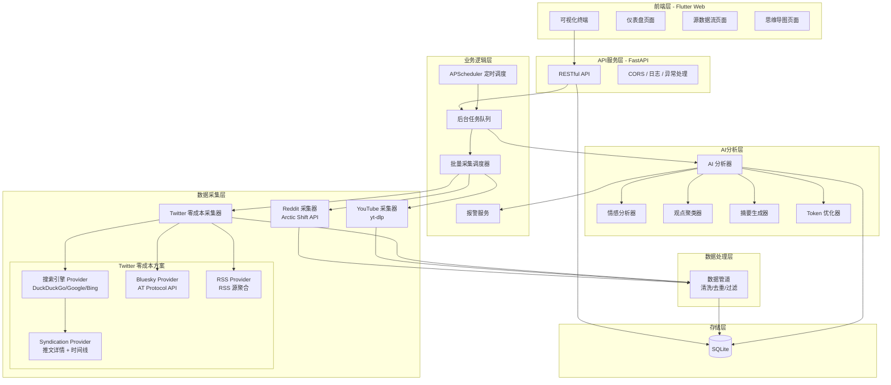

# TrendPulse 舆情脉冲

多源社交媒体舆情分析系统。输入关键词，自动从 Reddit、YouTube、X(Twitter)、Bluesky 抓取数据，使用 AI 生成情感分析、观点聚类和可视化报告。

## 功能特性

- **多源数据采集**: 支持 Reddit、YouTube、X(Twitter)、Bluesky 四大平台
  - Reddit: Arctic Shift 公开 API 批量采集
  - YouTube: yt-dlp 流式采集（无需 API Key）
  - X(Twitter): 零成本采集方案（Syndication API + 搜索引擎雪球扩展，无需官方 API）
  - Bluesky: AT Protocol 公开 API
- **AI 情感分析**: 调用大语言模型 API，生成 0-100 情感分数和分类标签
- **观点聚类**: 自动提取 3 个核心争议点，附带支持度百分比
- **智能摘要**: 将大量评论总结为 200-500 字的易读摘要
- **思维导图**: 将观点以 Mermaid 格式思维导图展示
- **定时监控**: 关键词订阅 + 定时采集（每 6 小时），情感分数低于阈值自动报警
- **Token 成本控制**: 自动分段处理、Map-Reduce 模式，记录 Token 使用量
- **可视化仪表盘**: Flutter 跨平台前端，包含热度指标、情感仪表盘、观点卡片等组件

## 系统架构



## 项目结构

```
TrendPulse/
├── backend/
│   ├── app/
│   │   ├── api/                    # API 端点 (FastAPI 路由)
│   │   │   ├── routes.py           # 路由注册
│   │   │   ├── schemas.py          # Pydantic 请求/响应模型
│   │   │   ├── collections.py      # 采集任务端点
│   │   │   ├── analysis.py         # 分析结果端点
│   │   │   ├── posts.py            # 帖子列表端点
│   │   │   ├── subscriptions.py    # 订阅管理端点
│   │   │   └── mindmap.py          # 思维导图端点
│   │   ├── analysis/               # AI 分析模块
│   │   │   ├── ai_analyzer.py      # AI 分析协调器
│   │   │   ├── sentiment_analyzer.py # 情感分析器
│   │   │   ├── opinion_clusterer.py  # 观点聚类器
│   │   │   ├── summary_generator.py  # 摘要生成器
│   │   │   ├── llm_client.py        # LLM 客户端
│   │   │   └── mermaid_generator.py  # Mermaid 生成器
│   │   ├── collectors/             # 数据采集模块
│   │   │   ├── base.py             # 采集引擎基类
│   │   │   ├── reddit_batch_collector.py   # Reddit Arctic Shift 批量采集
│   │   │   ├── youtube_batch_collector.py  # YouTube yt-dlp 流式采集
│   │   │   ├── twitter_zero_cost_collector.py # Twitter 零成本采集编排器
│   │   │   └── zero_cost/          # Twitter 零成本采集子模块
│   │   │       ├── models.py       # 数据模型 (SearchResult, ProviderStats)
│   │   │       ├── constants.py    # 配置常量
│   │   │       ├── utils.py        # 工具函数
│   │   │       ├── search_engine_provider.py   # 搜索引擎 + 雪球扩展
│   │   │       ├── syndication_provider.py     # Syndication API 推文获取
│   │   │       ├── bluesky_provider.py         # Bluesky AT Protocol
│   │   │       └── rss_provider.py             # RSS 源聚合
│   │   ├── models/                 # 数据模型
│   │   │   ├── data_models.py      # Python 数据类
│   │   │   └── db_models.py        # SQLAlchemy ORM 模型
│   │   ├── processing/             # 数据处理模块
│   │   │   └── data_pipeline.py    # 数据管道 (清洗/去重/过滤)
│   │   ├── config.py               # 配置管理
│   │   ├── database.py             # 数据库连接
│   │   ├── main.py                 # FastAPI 应用入口
│   │   ├── batch_scheduler.py      # 批量采集调度器
│   │   ├── scheduler.py            # 定时调度器
│   │   └── alert_service.py        # 报警服务
│   ├── tests/                      # 测试文件 (单元测试 + 属性测试)
│   ├── requirements.txt
│   └── .env.example
├── frontend/                       # Flutter 前端应用
│   ├── lib/
│   │   ├── api/                    # API 客户端
│   │   ├── models/                 # 数据模型
│   │   ├── providers/              # 状态管理 (Provider)
│   │   ├── screens/                # 页面
│   │   ├── widgets/                # UI 组件
│   │   ├── config.dart             # 配置
│   │   └── main.dart               # 入口
│   └── pubspec.yaml
├── start.sh                        # 一键启动脚本
├── TECHNICAL.md                    # 技术文档
└── README.md
```

## 本地运行

### 环境要求

- Python 3.10+
- Flutter 3.x (SDK >=3.0.0)

### 一键启动

```bash
# 使用启动脚本（自动启动后端 + 构建前端 + 启动前端服务）
chmod +x start.sh
./start.sh
```

启动后访问：
- 前端页面: http://localhost:3000
- 后端 API: http://localhost:8000
- API 文档: http://localhost:8000/docs

### 手动启动

#### 后端

```bash
# 1. 进入后端目录
cd backend

# 2. 创建虚拟环境并安装依赖
python -m venv .venv
source .venv/bin/activate   # macOS/Linux
pip install -r requirements.txt

# 3. 配置环境变量
cp .env.example .env
# 编辑 .env 文件，填入你的 LLM API 密钥

# 4. 启动服务
uvicorn backend.app.main:app --host 0.0.0.0 --port 8000 --reload
```

#### 前端

```bash
# 1. 进入前端目录
cd frontend

# 2. 安装依赖
flutter pub get

# 3. 构建并运行 Web 版本
flutter build web
# 使用 Python 内置 HTTP 服务器托管
cd build/web && python -m http.server 3000
```

### 运行测试

```bash
# 后端全部测试（在项目根目录执行）
backend/.venv/bin/python -m pytest backend/tests/ -v --tb=short

# 运行特定模块测试
backend/.venv/bin/python -m pytest backend/tests/test_twitter_zero_cost_search_engine_unit.py -v

# 运行属性测试
backend/.venv/bin/python -m pytest backend/tests/test_twitter_zero_cost_utils_property.py -v
```

## API 文档

所有 API 端点以 `/api/v1` 为前缀。启动后端后访问 http://localhost:8000/docs 查看交互式 Swagger UI。

### 采集任务

| 方法 | 路径 | 说明 |
|------|------|------|
| POST | `/api/v1/collections` | 创建采集任务 |
| GET | `/api/v1/collections/{task_id}` | 查询任务状态 |

**创建采集任务** `POST /api/v1/collections`

请求体:
```json
{
  "keyword": "人工智能",
  "language": "zh",
  "limit": 100,
  "sources": ["reddit", "youtube", "twitter"]
}
```

响应:
```json
{
  "task_id": "uuid-string",
  "status": "queued",
  "created_at": "2025-01-01T00:00:00Z"
}
```

### 分析结果

| 方法 | 路径 | 说明 |
|------|------|------|
| GET | `/api/v1/analysis/{task_id}` | 获取分析结果 |

响应:
```json
{
  "sentiment_score": 65.5,
  "sentiment_label": "neutral",
  "opinions": [
    { "description": "观点描述", "support_rate": 45.0 }
  ],
  "summary": "摘要文本...",
  "heat_score": 78.3
}
```

### 帖子列表

| 方法 | 路径 | 说明 |
|------|------|------|
| GET | `/api/v1/posts/{task_id}?page=1&page_size=20` | 获取原始帖子（分页） |

### 订阅管理

| 方法 | 路径 | 说明 |
|------|------|------|
| POST | `/api/v1/subscriptions` | 创建关键词订阅 |
| GET | `/api/v1/subscriptions` | 获取活跃订阅列表 |
| DELETE | `/api/v1/subscriptions/{id}` | 取消订阅 |

### 思维导图

| 方法 | 路径 | 说明 |
|------|------|------|
| GET | `/api/v1/mindmap/{task_id}` | 获取 Mermaid 思维导图代码 |

## 环境变量

| 变量名 | 必需 | 默认值 | 说明 |
|--------|------|--------|------|
| `LLM_API_KEY` | 是 | - | 大语言模型 API 密钥 |
| `LLM_API_BASE_URL` | 否 | `https://api.openai.com/v1` | LLM API 基础 URL |
| `LLM_MODEL` | 否 | `gpt-3.5-turbo` | 使用的模型名称 |
| `LLM_API_STYLE` | 否 | `openai` | API 风格：`openai` 或 `anthropic` |
| `TWITTER_ZERO_COST_ENABLED` | 否 | `true` | 启用 Twitter 零成本采集方案 |
| `TWITTER_BATCH_DELAY` | 否 | `2.0` | Twitter 批量采集批次间延迟（秒） |
| `TWITTER_PROXY` | 否 | - | 代理地址（如 `http://127.0.0.1:7890`） |
| `APP_HOST` | 否 | `0.0.0.0` | 应用监听地址 |
| `APP_PORT` | 否 | `8000` | 应用监听端口 |
| `DATABASE_URL` | 否 | `sqlite:///accounts.db` | 数据库连接 URL |
| `TOKEN_WARNING_THRESHOLD` | 否 | `100000` | Token 使用量警告阈值 |
| `COLLECTION_BATCH_SIZE` | 否 | `500` | 采集批次大小 |

## 技术栈

| 层级 | 技术 |
|------|------|
| 后端框架 | FastAPI + Uvicorn |
| 数据库 | SQLite + SQLAlchemy ORM |
| 数据采集 | Arctic Shift API / yt-dlp / Syndication API / AT Protocol / curl_cffi |
| AI 分析 | OpenAI API (可配置) + tiktoken |
| 定时任务 | APScheduler |
| 前端框架 | Flutter 3.x (Web) |
| 状态管理 | Provider |
| 图表 | fl_chart |
| 测试 | pytest + Hypothesis (属性测试) |
